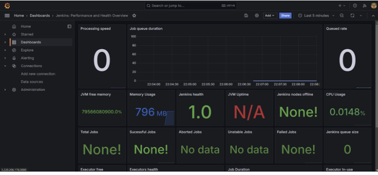

# Deploy Netflix Clone on Cloud using Jenkins - DevSecOps Project!


### 🚀 Workflow Overview

1. **Launch EC2 Instance & Deploy the App Locally**
   - Spin up an AWS EC2 instance and deploy the Netflix Clone app using a Docker container to ensure a consistent and isolated runtime environment.

2. **Integrate Security with SonarQube & Trivy**
   - Perform static code analysis using **SonarQube** to detect code quality issues.
   - Use **Trivy** to scan the Docker image for vulnerabilities, ensuring the container is secure before deployment.

3. **Automate CI/CD Pipeline with Jenkins**
   - Configure **Jenkins** to automate the full build lifecycle:
     - Build the Docker image.
     - Run security scans.
     - Push the secure image to DockerHub.
   - This streamlines the entire development-to-deployment process.

4. **Monitor Infrastructure with Prometheus & Grafana**
   - Set up **Prometheus** to collect metrics from EC2 and Jenkins (CPU usage, memory, job status).
   - Use **Grafana** to visualize these metrics with rich dashboards for real-time monitoring and alerting.

5. **Email Notifications via SMTP**
   - Configure SMTP to receive automated email alerts for job completions, failures, and resource threshold breaches, ensuring you're always informed of system status.

6. **Kubernetes Deployment via ArgoCD**
   - Use **ArgoCD** to deploy the application to a Kubernetes cluster.
   - ArgoCD handles continuous delivery by syncing your Git repository with the cluster and managing deployment rollouts.

This end-to-end DevSecOps pipeline ensures a secure, automated, and scalable cloud-native application deployment.


### **Phase 1: Initial Setup and Deployment**

## 🚀 Step 1: Launch EC2 Instance (Ubuntu 22.04)


### 🖥️ Provision the EC2 Instance

- Go to the **AWS Management Console**.
- Navigate to **EC2 Dashboard** and click on **Launch Instance**.
- Choose **Ubuntu Server 22.04 LTS** as the Amazon Machine Image (AMI).
- Select an instance type (e.g., `t2.micro` for free tier).
- Configure key pair and security group settings.
- Launch the instance.

### 🔐 Connect via SSH

Once your instance is running:

```bash
ssh -i "your-key.pem" ubuntu@<your-ec2-public-ip>


## 📦 Step 2: Clone the Code Repository

### 🔄 Update Packages

Before cloning the repository, make sure your system packages are up to date:

```bash
sudo apt-get update && sudo apt-get upgrade -y


## 🚀 Step 3: Install Docker and Run the App Using a Container

### 🐳 Install Docker on your EC2 instance

Make sure your system is up to date and install Docker:

```bash
sudo apt-get update
sudo apt-get install docker.io -y
sudo usermod -aG docker $USER     # Add your user to the Docker group
newgrp docker                     # Refresh group permissions
sudo chmod 777 /var/run/docker.sock  # Allow Docker to run without sudo
```

> ⚠️ If you're on a fresh instance, your default username is likely `ubuntu`.

---

### 📦 Build and Run the App in Docker

Make sure your codebase has a `Dockerfile`. Then run:

```bash
docker build -t netflix .
docker run -d --name netflix -p 8081:80 netflix:latest
```

Now your app should be running and accessible via `http://<EC2_Public_IP>:8081`.

> ⚠️ **Note**: If your application uses The Movie Database (TMDB) API, you will need to include a valid API key in your environment or codebase. Otherwise, the container may fail to fetch movie data and throw errors.

---

### 🧹 Clean Up (Optional)

If you want to stop and delete the running container and image:

```bash
docker stop netflix
docker rm netflix
docker rmi netflix
```


## 🔑 Step 4: Get the API Key


- Open a web browser and navigate to [TMDB (The Movie Database)](https://www.themoviedb.org/).
- Click on **Login** and create an account.
- After logging in, go to your profile and click **Settings**.
- In the sidebar, select **API**.
- Click **Create** to generate a new API key and accept the terms.
- Fill in the required details and hit **Submit**.
- You will now receive your **TMDB V3 API key**.

### 🛠️ Rebuild Docker Image with API Key

Replace `<your-api-key>` with the key received above:

```bash
docker build --build-arg TMDB_V3_API_KEY=<your-api-key> -t netflix .
```

---

## 🔒 Phase 2: Security Setup


### 1️⃣ Install SonarQube & Trivy

#### 🚀 Run SonarQube in Docker:

```bash
docker run -d --name sonar -p 9000:9000 sonarqube:lts-community
```

- Access it at: `http://<your-EC2-public-IP>:9000`
- Default credentials: `admin` / `admin`

#### 🛡️ Install Trivy:

```bash
sudo apt-get install wget apt-transport-https gnupg lsb-release
wget -qO - https://aquasecurity.github.io/trivy-repo/deb/public.key | sudo apt-key add -
echo deb https://aquasecurity.github.io/trivy-repo/deb $(lsb_release -sc) main | sudo tee -a /etc/apt/sources.list.d/trivy.list
sudo apt-get update
sudo apt-get install trivy
```

#### 🔍 Scan Docker Image:

```bash
trivy image <imageid>
```

---

### 2️⃣ Configure SonarQube Integration

- Connect SonarQube to your CI/CD pipeline.
- Generate a **Sonar Token** in SonarQube.
- In Jenkins → **Manage Jenkins** → **Credentials**, add this as a **Secret Text** credential.

---

## 🔁 Phase 3: CI/CD Pipeline with Jenkins


### ⚙️ Install Jenkins and Java

```bash
sudo apt update
sudo apt install fontconfig openjdk-17-jre
java -version
```

#### ✅ Install Jenkins:

```bash
sudo wget -O /usr/share/keyrings/jenkins-keyring.asc https://pkg.jenkins.io/debian-stable/jenkins.io-2023.key
echo deb [signed-by=/usr/share/keyrings/jenkins-keyring.asc] https://pkg.jenkins.io/debian-stable binary/ | sudo tee /etc/apt/sources.list.d/jenkins.list > /dev/null
sudo apt-get update
sudo apt-get install jenkins
sudo systemctl start jenkins
sudo systemctl enable jenkins
```

- Jenkins will be accessible at: `http://<your-EC2-public-IP>:8080`

---

### 🔌 Jenkins Plugin Installation

Go to: **Manage Jenkins → Plugins → Available**  
Install the following (without restart):

1. Eclipse Temurin Installer  
2. SonarQube Scanner  
3. NodeJs Plugin  
4. Email Extension Plugin  
5. Docker  
6. Docker Commons  
7. Docker Pipeline  
8. Docker API  
9. docker-build-step  
10. OWASP Dependency-Check  

---

### 🛠️ Configure Global Tools

Go to **Manage Jenkins → Global Tool Configuration**:

- Set up:
  - JDK (name: `jdk17`)
  - Node.js (name: `node16`)
  - Sonar Scanner
  - Dependency-Check (name: `DP-Check`)

---

### 🔐 Add Credentials

- Go to **Manage Jenkins → Credentials → Global → Add Credentials**
- Add:
  - Sonar Token (`Secret Text`)
  - DockerHub credentials (ID: `docker`)

---

## 🧪 CI/CD Pipeline Script

```groovy
pipeline {
    agent any
    tools {
        jdk 'jdk17'
        nodejs 'node16'
    }
    environment {
        SCANNER_HOME = tool 'sonar-scanner'
    }
    stages {
        stage('Clean Workspace') {
            steps {
                cleanWs()
            }
        }
        stage('Checkout from Git') {
            steps {
                git branch: 'main', url: 'https://github.com/N4si/DevSecOps-Project.git'
            }
        }
        stage("SonarQube Analysis") {
            steps {
                withSonarQubeEnv('sonar-server') {
                    sh '''$SCANNER_HOME/bin/sonar-scanner -Dsonar.projectName=Netflix \
                    -Dsonar.projectKey=Netflix'''
                }
            }
        }
        stage("Quality Gate") {
            steps {
                script {
                    waitForQualityGate abortPipeline: false, credentialsId: 'Sonar-token'
                }
            }
        }
        stage('Install Dependencies') {
            steps {
                sh "npm install"
            }
        }
        stage('OWASP File System Scan') {
            steps {
                dependencyCheck additionalArguments: '--scan ./ --disableYarnAudit --disableNodeAudit', odcInstallation: 'DP-Check'
                dependencyCheckPublisher pattern: '**/dependency-check-report.xml'
            }
        }
        stage('Trivy File System Scan') {
            steps {
                sh "trivy fs . > trivyfs.txt"
            }
        }
        stage('Docker Build & Push') {
            steps {
                script {
                    withDockerRegistry(credentialsId: 'docker', toolName: 'docker') {
                        sh "docker build --build-arg TMDB_V3_API_KEY=<your-api-key> -t netflix ."
                        sh "docker tag netflix arupaandey/netflix:latest"
                        sh "docker push arupaandey/netflix:latest"
                    }
                }
            }
        }
        stage('Trivy Image Scan') {
            steps {
                sh "trivy image arupaandey/netflix:latest > trivyimage.txt"
            }
        }
        stage('Deploy to Container') {
            steps {
                sh 'docker run -d --name netflix -p 8081:80 arupaandey/netflix:latest'
            }
        }
    }
}
```

---

## ❗ Troubleshooting: Docker Login Error in Jenkins

If you see a **"docker login failed"** error in Jenkins:

```bash
sudo su
sudo usermod -aG docker jenkins
sudo systemctl restart jenkins
```

This ensures Jenkins has the right permissions to access Docker.

## 📊 Phase 4: Monitoring

### 🔧 Install Prometheus and Grafana

  


---

### 🛠️ Installing Prometheus

1. **Create a dedicated Prometheus user** and download the binary:

```bash
sudo useradd --system --no-create-home --shell /bin/false prometheus
wget https://github.com/prometheus/prometheus/releases/download/v2.47.1/prometheus-2.47.1.linux-amd64.tar.gz
```

2. **Extract and organize files:**

```bash
tar -xvf prometheus-2.47.1.linux-amd64.tar.gz
cd prometheus-2.47.1.linux-amd64/
sudo mkdir -p /data /etc/prometheus
sudo mv prometheus promtool /usr/local/bin/
sudo mv consoles/ console_libraries/ /etc/prometheus/
sudo mv prometheus.yml /etc/prometheus/prometheus.yml
```

3. **Set ownership:**

```bash
sudo chown -R prometheus:prometheus /etc/prometheus/ /data/
```

4. **Create systemd unit file:**

```bash
sudo nano /etc/systemd/system/prometheus.service
```

Paste the following content:

```ini
[Unit]
Description=Prometheus
Wants=network-online.target
After=network-online.target

StartLimitIntervalSec=500
StartLimitBurst=5

[Service]
User=prometheus
Group=prometheus
Type=simple
Restart=on-failure
RestartSec=5s
ExecStart=/usr/local/bin/prometheus \
  --config.file=/etc/prometheus/prometheus.yml \
  --storage.tsdb.path=/data \
  --web.console.templates=/etc/prometheus/consoles \
  --web.console.libraries=/etc/prometheus/console_libraries \
  --web.listen-address=0.0.0.0:9090 \
  --web.enable-lifecycle

[Install]
WantedBy=multi-user.target
```

5. **Enable and start Prometheus:**

```bash
sudo systemctl enable prometheus
sudo systemctl start prometheus
sudo systemctl status prometheus
```

Open:  
`http://<your-server-ip>:9090`

---

### 🧩 Install Node Exporter

1. **Create a user and download the binary:**

```bash
sudo useradd --system --no-create-home --shell /bin/false node_exporter
wget https://github.com/prometheus/node_exporter/releases/download/v1.6.1/node_exporter-1.6.1.linux-amd64.tar.gz
```

2. **Extract, move and clean:**

```bash
tar -xvf node_exporter-1.6.1.linux-amd64.tar.gz
sudo mv node_exporter-1.6.1.linux-amd64/node_exporter /usr/local/bin/
rm -rf node_exporter*
```

3. **Create systemd unit file:**

```bash
sudo nano /etc/systemd/system/node_exporter.service
```

Paste the following content:

```ini
[Unit]
Description=Node Exporter
Wants=network-online.target
After=network-online.target

StartLimitIntervalSec=500
StartLimitBurst=5

[Service]
User=node_exporter
Group=node_exporter
Type=simple
Restart=on-failure
RestartSec=5s
ExecStart=/usr/local/bin/node_exporter --collector.logind

[Install]
WantedBy=multi-user.target
```

4. **Enable and start Node Exporter:**

```bash
sudo systemctl enable node_exporter
sudo systemctl start node_exporter
sudo systemctl status node_exporter
```

Metrics will now be available on:  
`http://<your-server-ip>:9100/metrics`

---

### ⚙️ Configure Prometheus Scrape Targets

Edit the Prometheus config file:

```bash
sudo nano /etc/prometheus/prometheus.yml
```

Add the following:

```yaml
global:
  scrape_interval: 15s

scrape_configs:
  - job_name: 'node_exporter'
    static_configs:
      - targets: ['localhost:9100']

  - job_name: 'jenkins'
    metrics_path: '/prometheus'
    static_configs:
      - targets: ['<your-jenkins-ip>:<your-jenkins-port>']
```

Replace `<your-jenkins-ip>` and `<your-jenkins-port>` accordingly.

Check config validity:

```bash
promtool check config /etc/prometheus/prometheus.yml
```

Reload Prometheus without restart:

```bash
curl -X POST http://localhost:9090/-/reload
```

Check scrape targets:  
`http://<your-server-ip>:9090/targets`

---

### 📈 Install and Configure Grafana



#### 🔧 Step 1: Install Dependencies

```bash
sudo apt-get update
sudo apt-get install -y apt-transport-https software-properties-common
```

#### 🔐 Step 2: Add GPG Key

```bash
wget -q -O - https://packages.grafana.com/gpg.key | sudo apt-key add -
```

#### 📦 Step 3: Add Grafana Repository

```bash
echo "deb https://packages.grafana.com/oss/deb stable main" | sudo tee -a /etc/apt/sources.list.d/grafana.list
```

#### 💾 Step 4: Install Grafana

```bash
sudo apt-get update
sudo apt-get -y install grafana
```

#### 🔁 Step 5: Enable and Start Grafana

```bash
sudo systemctl enable grafana-server
sudo systemctl start grafana-server
```

Check status:

```bash
sudo systemctl status grafana-server
```

Access Grafana:  
`http://<your-server-ip>:3000`  
Default credentials: `admin` / `admin`

---

### 🧩 Grafana Setup

1. **Change default password after login.**

2. **Add Prometheus Data Source:**
   - Go to ⚙️ **Configuration** > **Data Sources**
   - Click **Add data source**
   - Select **Prometheus**
   - Set URL: `http://localhost:9090`
   - Click **Save & Test**

3. **Import a Prebuilt Dashboard:**
   - Click ➕ **Create** > **Import**
   - Use Dashboard ID like `1860` or other Prometheus-based dashboards
   - Select your Prometheus source
   - Click **Import**

---

### 📡 Jenkins + Prometheus Plugin Integration

- Install **Prometheus Metrics Plugin** in Jenkins.
- Jenkins exposes metrics at:  
  `http://<jenkins-ip>:8080/prometheus`

Make sure this path is defined in `prometheus.yml` as shown earlier.

Now, Prometheus will scrape Jenkins and Node Exporter metrics, and Grafana will visualize them.

✅ **Monitoring stack successfully set up with Prometheus + Grafana + Jenkins + Node Exporter**

### 🔁 Step 5: Enable and Start Grafana Service

To ensure Grafana starts automatically on boot:

```bash
sudo systemctl enable grafana-server
```

Start the Grafana service:

```bash
sudo systemctl start grafana-server
```

---

### 🔍 Step 6: Check Grafana Status

To confirm Grafana is running correctly:

```bash
sudo systemctl status grafana-server
```

---

### 🌐 Step 7: Access Grafana Web Interface

Open a web browser and visit:  
`http://<your-server-ip>:3000`

- Default login credentials:
  - **Username:** `admin`
  - **Password:** `admin`

---

### 🔑 Step 8: Change Default Password

After the first login, Grafana will prompt you to change your password for security. Follow the on-screen instructions to set a new password.

---

### ⚙️ Step 9: Add Prometheus as a Data Source

1. Click the **⚙️ gear icon** in the left sidebar (Configuration).
2. Select **Data Sources**.
3. Click **Add data source**.
4. Choose **Prometheus** from the list.
5. In the **HTTP** section:
   - Set **URL** to: `http://localhost:9090` (if Prometheus is on the same machine).
6. Click **Save & Test** to validate the connection.

---

### 📈 Step 10: Import a Prebuilt Dashboard

To quickly visualize your Prometheus metrics:

1. Click the ➕ **plus icon** in the left sidebar.
2. Choose **Import**.
3. Enter dashboard ID (e.g., `1860` for Node Exporter Full).
4. Click **Load**.
5. Select **Prometheus** as the data source.
6. Click **Import**.

Your dashboard will now show real-time metrics from Prometheus!

---

## 🔗 Prometheus Plugin Integration for Jenkins Monitoring

To enable CI/CD pipeline monitoring via Prometheus:

1. **Install Prometheus Metrics Plugin** in Jenkins:
   - Navigate to **Manage Jenkins → Manage Plugins → Available**
   - Search for and install **Prometheus Metrics Plugin**

2. Jenkins metrics will now be exposed at:

```
http://<jenkins-ip>:8080/prometheus
```

3. In Prometheus, update `prometheus.yml` as follows:

```yaml
- job_name: 'jenkins'
  metrics_path: '/prometheus'
  static_configs:
    - targets: ['<jenkins-ip>:8080']
```

Reload Prometheus:

```bash
curl -X POST http://localhost:9090/-/reload
```

Now Jenkins metrics will be scraped by Prometheus and available for visualization in Grafana.

---

✅ **You’ve now completed full-stack monitoring with Prometheus, Grafana, Node Exporter, and Jenkins!**


## 📢 Phase 5: Notification

### 📨 Implement Notification Services

Set up email notifications or other alerting mechanisms in Jenkins to stay informed about your build status.

#### Example: Configure Email Notifications in Jenkins

1. Go to **Manage Jenkins** → **Configure System**
2. Scroll down to **E-mail Notification**
3. Add:
   - SMTP server (e.g., `smtp.gmail.com`)
   - Default user email suffix
   - SMTP authentication credentials
   - Port: `587`
   - Enable TLS

4. Add **Post-build Actions** in your pipeline:
   - Select **E-mail Notification**
   - Set recipients and configure trigger conditions (e.g., failure, unstable, etc.)

---

## ☸️ Phase 6: Kubernetes & ArgoCD Deployment

### 🏗️ Create Kubernetes Cluster with Node Groups

Use AWS EKS, GKE, or any managed Kubernetes provider to set up a cluster with autoscaling node groups. This creates a highly available and scalable environment for deploying containerized applications.

---

### 📡 Monitor Kubernetes with Prometheus

Prometheus helps monitor your cluster with metrics from all nodes. You'll use **Node Exporter** to capture system-level metrics.

#### 🧰 Install Node Exporter via Helm

1. Add Prometheus Community Helm Repo:

```bash
helm repo add prometheus-community https://prometheus-community.github.io/helm-charts
```

2. Create a dedicated namespace:

```bash
kubectl create namespace prometheus-node-exporter
```

3. Install Node Exporter:

```bash
helm install prometheus-node-exporter prometheus-community/prometheus-node-exporter --namespace prometheus-node-exporter
```

---

### 🔧 Configure Prometheus to Scrape Kubernetes Metrics

Update your `prometheus.yml` file with a new scrape job:

```yaml
- job_name: 'Netflix'
  metrics_path: '/metrics'
  static_configs:
    - targets: ['<node1-ip>:9100']
```

Replace `<node1-ip>` with the IP address of your Kubernetes node running Node Exporter.  
Save the file and reload Prometheus:

```bash
curl -X POST http://localhost:9090/-/reload
```

---

### 🚀 Deploy Application with ArgoCD

1. **Install ArgoCD**  
Follow the official instructions: [EKS ArgoCD Install Guide](https://archive.eksworkshop.com/intermediate/290_argocd/install/)

2. **Connect Your GitHub Repository**  
- Navigate to ArgoCD UI or use CLI.
- Set your GitHub repository as the **source** for application manifests.

3. **Create an ArgoCD Application**
Define an ArgoCD app using UI or a manifest like below:

```yaml
apiVersion: argoproj.io/v1alpha1
kind: Application
metadata:
  name: netflix-app
  namespace: argocd
spec:
  project: default
  source:
    repoURL: 'https://github.com/your-org/your-repo.git'
    targetRevision: HEAD
    path: path/to/k8s/manifests
  destination:
    server: 'https://kubernetes.default.svc'
    namespace: default
  syncPolicy:
    automated:
      prune: true
      selfHeal: true
```

4. **Access the Application**
Make sure port `30007` is allowed in your EC2 Security Group. Then open:

```
http://<NodeIP>:30007
```

Your deployed app should now be accessible via the browser.

---

## 🧹 Phase 7: Cleanup

### 🛑 Cleanup AWS Resources

- Navigate to **AWS EC2 Console**
- Identify EC2 instances used for setup, Jenkins, SonarQube, Prometheus, etc.
- Terminate instances you no longer need to avoid extra billing.


---

✅ **You have now completed all deployment phases — from containerization and CI/CD, to monitoring, ArgoCD orchestration, and cleanup. Well done!**

